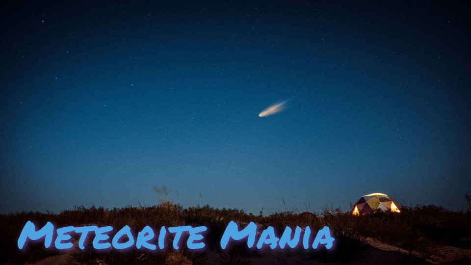
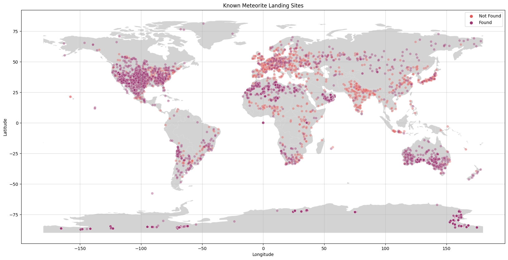
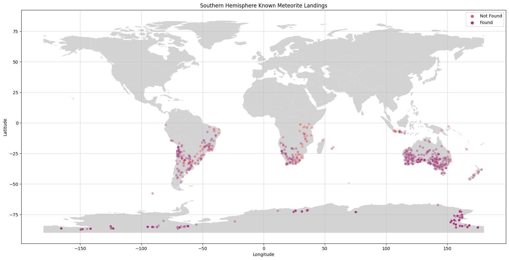
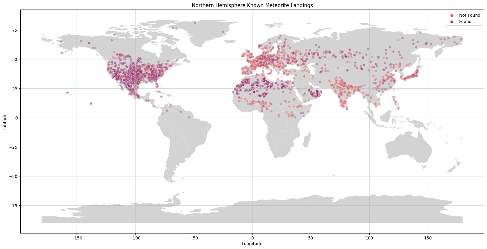

# Meteorite Mania
**Author:** Jonathan Fetterolf

## Overview
This notebook analayzes a dataset of known meteorite landing sites and the data associated with those meteorites. I derived some statistics about the known meteorites and mapped their landing sites as well as looked into where the majority of meteorites fell. In terms of mass, the largest known meteorite is 60000kg which is contrasted by the smallest that comes in at 1e-05kg. The mean mass of the dataset is approximately 15.6kg, while the median is approximately 0.029kg. Nearly 74% of known meteorite landing sites are in the southern hemisphere while 26% are in the northern hemisphere.This overwhelming amount of known meteorite landing sites can be explained by this information compiled by the [Department of Earth and Planetary Sciences](https://sites.wustl.edu/meteoritesite/items/some-meteorite-statistics/) at the Washington University in St. Louis. 

They state:  *"Nearly all meteorites are found in deserts. (Yes, Antarctica is a desert because the annual precipitation rate is very low.) Deserts are places that accumulate meteorites over thousands of years and then nothing much happens to the meteorite. Also, meteorites are easier to find in deserts than in places with topography, vegetation, and other rocks."*

## Understanding & Cleaning Data
This comprehensive data set from The Meteoritical Society contains information on all of the known meteorite landings up to 2013. The Fusion Table is collected by Javier de la Torre. This data consists of 34,513 meteorites. This dataset was obtained [here](https://catalog.data.gov/dataset/meteorite-landings) through [data.gov](https://data.gov/).

## Conclusions
**Mass**
- In terms of mass, the largest known meteorite is 60000kg which is contrasted by the smallest that comes in at 1e-05kg. 
- The mean mass of the dataset is approximately 15.6kg.
- The median is approximately 0.029kg. 

**Location**

Approximately 74% of known meteorite landing sites are in the southern hemisphere.

Approximately 26% of known meteorite landing sites are in the northern  hemisphere.

**Limitations**
- The dataset only contains data up to 2013.
- There are many known sites exactly on the equator. I did not include these in either northern, or southern hemisphere.
- Many sites in the southern hemisphere, specifically Antartica are close so the visual representation of the data leads you to believe there are more landing sites in the northern hemisphere when in actuallity, it is the opposite conclusion. 